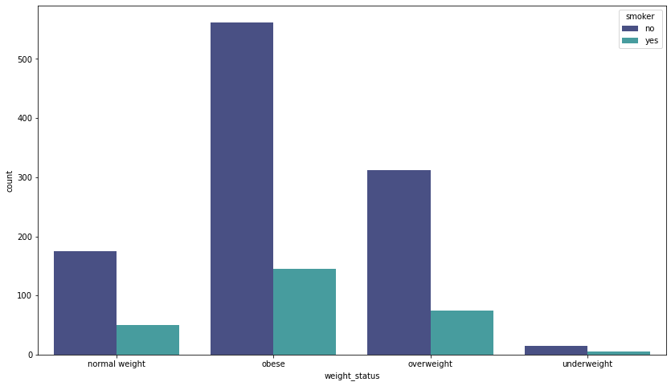
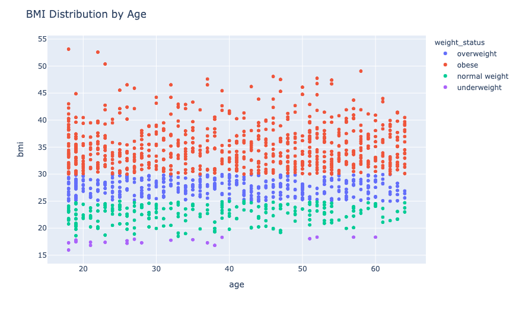
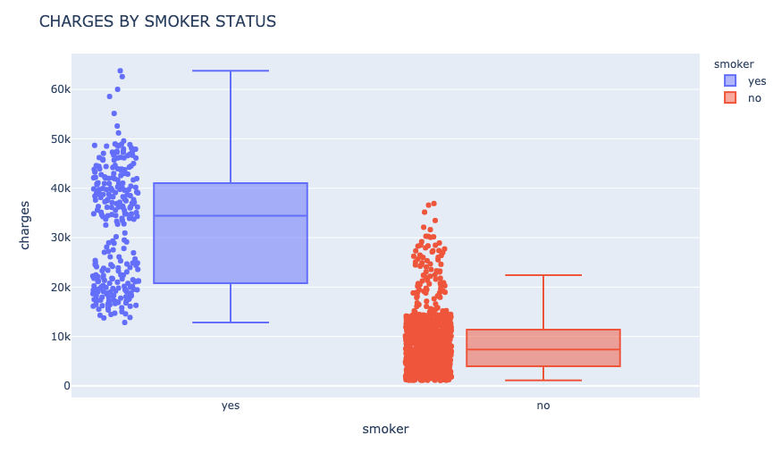

# EDA_ML_Medical-Costs
An exploratory data analysis and machine learning implementation of a Medical Costs data set from Kaggle.

## PROJECT DESCRIPTION
In this notebook we will look at samples of medical costs of hospital patients along with other variables such as age, sex, body mass index, smoker status.

Once a thorough exploratory data analysis is completed, various machine learning models will be implemented to predict medical costs using the feature variables contained within the dataset.

## ABOUT THE DATA 

#### SOURCE: 
The data used in this note book comes from Kaggle (https://www.kaggle.com/mirichoi0218/insurance?select=insurance.csv)
provided by Miri Choi (https://www.kaggle.com/mirichoi0218)

## METHODOLOGY

This notebook consists of an exploratory data analysis of the variables presented in the dataset followed by feature selection and predictive model building and evaluation. 
The EDA section makes use of visualization techniques such as bar charts, box plots, and scatter plots to get an overview of the data and the correlation between each feature and the target variable.

This notebook consists of an exploratory data analysis of the variables presented in the dataset. Among some of the variables are the follwoing:

| SMOKER & WEIGHT   | BMI & AGE | CHARGES OF SMOKERS |
| ------------- |:-------------:| -----:|
|         |            |   |

Univariate, bivariate, and multivariate analyses were performed to determine any correlating factors. 

## OUTSTANDING OBSERVATIONS

* Smoker status is the variable with the most influence on the amount a patient is charged during a hospital visit followed by age and bmi.

## MODEL BUILDING

MODELS USED: 
* Multiple Linear Regression
* Lasso Regression
* Ridge Regression
* Random Forest Regression
* Polynomial Regression

## MODEL EVALUATION: 

Several metrics were used to evaluate our models including:
* Mean Squared Error
* Root Mean Squared Error
* Mean Absolute Error
* R2 Score
* Residual Sum of Squares
* Explained Variance

## CONCLUSION

The **Random Forest Regression Model** is the model that gives us the best results with an R Squared score of 86% and a lower error scores than the other models. 

Thanks for stopping by!

Milton
